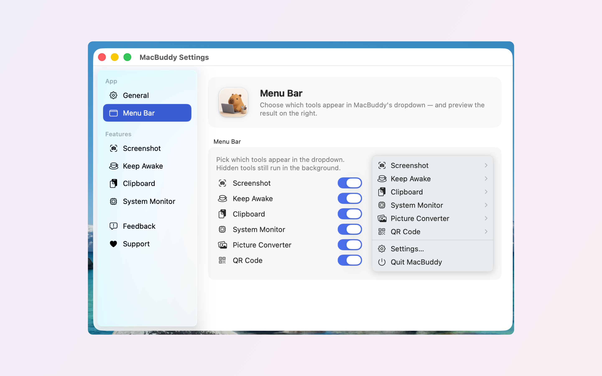
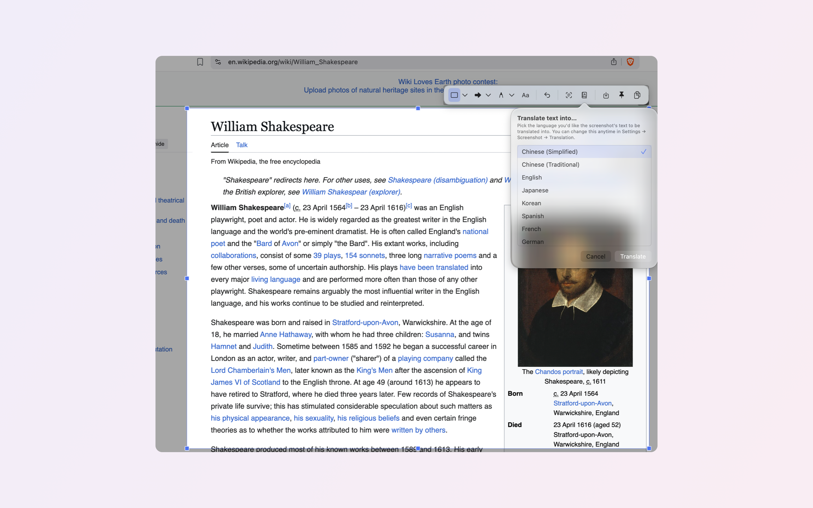
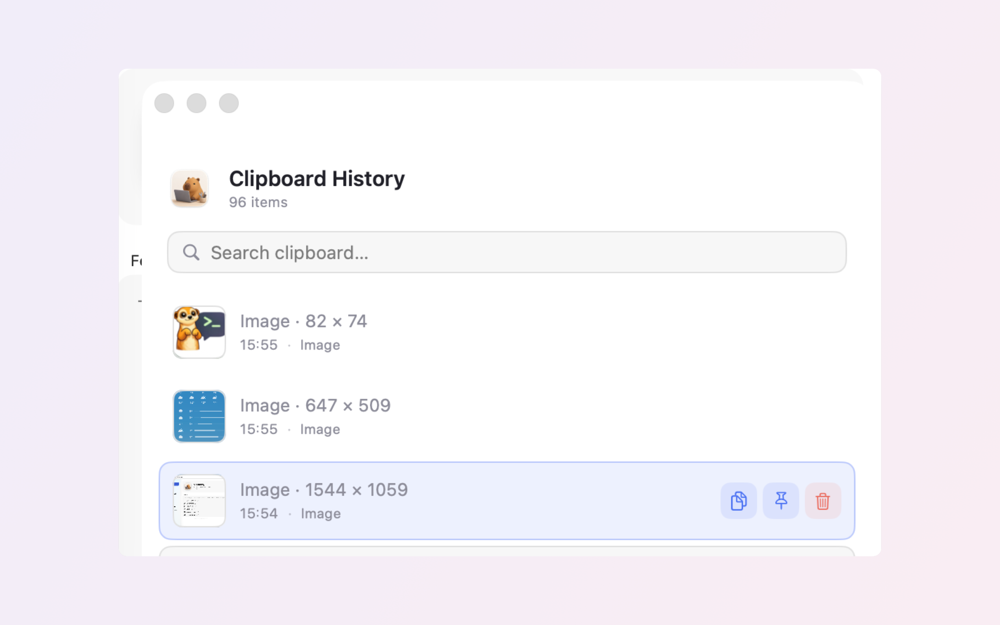
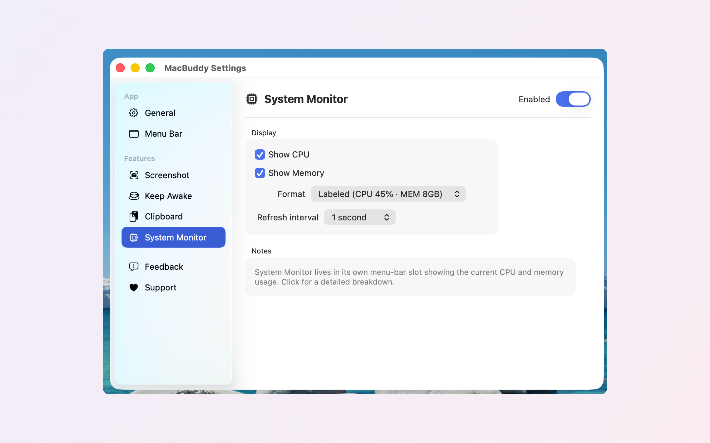

<div align="center">

# CapyBuddy

**Your friendly Mac companion — a menu-bar multi-tool.**

100% free and open source. No paywall, no accounts, no tracking.



</div>

## What it does

CapyBuddy lives in your menu bar and bundles a set of everyday Mac utilities.
Turn individual tools on or off in **Settings → General**, and choose which
ones appear in the dropdown in **Settings → Menu Bar**.

| Tool | Description |
|------|-------------|
| **Screenshot** | Capture a region with a global hotkey, then annotate, OCR, copy, save, or pin it. |
| **Screen Recording** | Capture full-screen, a window, or a drag-selected region to MP4/MOV with optional system audio and microphone. |
| **Video Editor** | Play, trim, crop, mute or re-speed a clip and export it — handy right after a recording. |
| **Clipboard** | Keeps a history of recent clipboard items so you can paste anything you copied earlier. |
| **Keep Awake** | Prevents your Mac from sleeping or dimming the display for a chosen duration. |
| **System Monitor** | A menu-bar status item showing live CPU, memory, and other system stats. |
| **Picture Converter** | Drag-and-drop conversion between PNG, JPEG, HEIC, TIFF, GIF, AVIF, ICO, BMP, ICNS, JP2. |
| **Compressor** | Compress and extract zip, tar, tar.gz, and gz archives. |
| **QR Code** | Generate QR codes — colors, dot/eye shapes, embedded logo, save or copy. |
| **Space Shortcut** | Hold Space and tap a key to instantly launch or focus your most-used apps. |

<div align="center">





</div>

## Install

Download the latest notarized `CapyBuddy.app` from the
[**Releases**](https://github.com/ATLAI-TECH/CappyBuddyOfficial/releases) page,
unzip it, and drag it to `/Applications`. The app auto-updates via Sparkle.

Some tools need permissions you grant on first use:
- **Screen Recording** — Screenshot, Screen Recording
- **Accessibility** — Space Shortcut, snap-to-element screenshots, recording hotkey

> CapyBuddy is distributed directly (Developer ID, notarized) rather than via the
> Mac App Store, because features like Space Shortcut rely on a global event tap
> that the App Store sandbox forbids. See `design/DISTRIBUTION_STRATEGY.md`.

## Build from source

Requirements: macOS, Xcode 16+, an Apple Developer ID (only needed for signing
a distributable build).

```bash
git clone https://github.com/ATLAI-TECH/CappyBuddyOfficial.git
cd CappyBuddyOfficial
open CapyBuddy.xcodeproj   # then build & run the "CapyBuddy" scheme
```

Or from the command line:

```bash
xcodebuild -project CapyBuddy.xcodeproj -scheme CapyBuddy -configuration Debug build
xcodebuild -project CapyBuddy.xcodeproj -scheme CapyBuddy test
```

### Cutting a release

`scripts/release.sh` archives, signs, notarizes, staples, zips, and regenerates
the Sparkle `appcast.xml`. It needs your Developer ID certificate, a notary
credential profile, and Sparkle's signing key — see the header of the script.

## Architecture

Each tool conforms to the `Feature` protocol (`CapyBuddy/Core/Feature.swift`)
and is registered in `AppDelegate`. `FeatureRegistry` owns lifecycle
(start/stop) and persistence of enabled/visible state. UI is SwiftUI; the
menu-bar plumbing is AppKit (`MenuBarManager`).

## License

[MIT](LICENSE) © AtLAI-tech.
